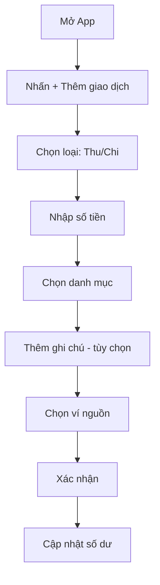
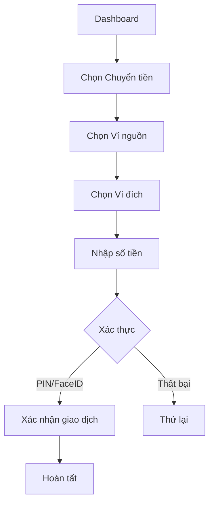
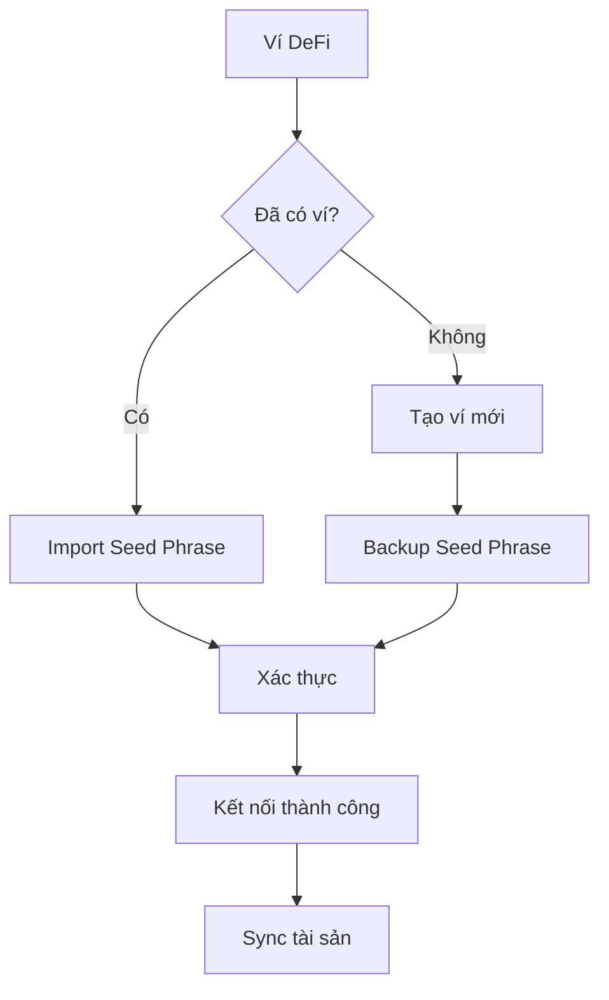

## 10. Yêu Cầu Thiết Kế (Design Requirements)

### 10.1 Tổng Quan Thiết Kế

W4S (Wallet For Self) là ứng dụng ví điện tử đa năng được thiết kế với giao diện hiện đại, tập trung vào việc **quản lý tài chính cá nhân** một cách toàn diện. Ứng dụng tích hợp nhiều loại ví khác nhau:

- **Ví Chi tiêu (Spending Wallet)**: Quản lý chi tiêu hàng ngày, theo dõi thu chi
- **Ví Tài chính (Finance Wallet)**: Quản lý ngân sách, tiết kiệm, đầu tư
- **Ví Fiat (Fiat Wallet)**: Lưu trữ và giao dịch tiền pháp định (VND, USD...)
- **Ví DeFi (DeFi Wallet)**: Quản lý tài sản crypto, staking, yield farming

Thiết kế tuân theo nguyên tắc Material Design và Human Quicksandsface Guidelines để đảm bảo tính nhất quán trên cả hai nền tảng iOS và Android.

#### Nguyên tắc thiết kế chính:
- **Đơn giản & Trực quan**: Giao diện tối giản, dễ quản lý tài chính ngay từ lần đầu tiên
- **Nhất quán**: Sử dụng hệ thống design token thống nhất xuyên suốt ứng dụng
- **Bảo mật**: Thiết kế ưu tiên hiển thị thông tin nhạy cảm an toàn
- **Tiếp cận được**: Tuân thủ chuẩn WCAG 2.1 AA về accessibility
- **Responsive**: Thích ứng tốt với nhiều kích thước màn hình

---

### 10.2 Bảng Màu (Color Palette)

#### Primary Colors (Xanh dương)

| Token | Mã màu | RGB | Sử dụng |
|-------|--------|-----|---------|
| primary-1 | `#E5F0FC` | rgb(230, 238, 252) | Background nhạt |
| primary-2 | `#C2D7F7` | rgb(194, 215, 247) | Hover states |
| primary-3 | `#91B8F1` | rgb(145, 184, 241) | Border, divider |
| primary-4 | `#5496EC` | rgb(84, 150, 236) | Icons |
| primary-5 | `#2A77E5` | rgb(42, 119, 229) | Links |
| **primary-6** | `#0059DF` | rgb(0, 89, 223) | **Primary chính** |
| primary-7 | `#004CBE` | rgb(0, 76, 190) | Hover button |
| primary-8 | `#003F9E` | rgb(0, 63, 158) | Active states |
| primary-9 | `#00337F` | rgb(0, 51, 127) | Text đậm |
| primary-10 | `#002864` | rgb(0, 40, 100) | Darkest |

#### Secondary Colors (Xanh xám/Teal)

| Token | Mã màu | RGB | Sử dụng |
|-------|--------|-----|---------|
| secondary-1 | `#EFF0F9` | rgb(239, 248, 249) | Background |
| secondary-2 | `#DBE9F5` | rgb(216, 233, 240) | Card background |
| secondary-3 | `#B8D7E4` | rgb(185, 215, 228) | Borders |
| secondary-4 | `#90C4D8` | rgb(144, 196, 216) | Icons phụ |
| secondary-5 | `#79B2C5` | rgb(121, 178, 204) | Highlights |
| **secondary-6** | `#5CA2C1` | rgb(92, 162, 193) | **Secondary chính** |
| secondary-7 | `#4E8EA4` | rgb(78, 138, 164) | Hover |
| secondary-8 | `#447988` | rgb(68, 121, 136) | Active |
| secondary-9 | `#3A5B6E` | rgb(58, 91, 110) | Text |
| secondary-10 | `#294857` | rgb(41, 72, 87) | Darkest |

#### Neutral Colors (Xám)

| Token | Mã màu | RGB | Sử dụng |
|-------|--------|-----|---------|
| neutral-1 | `#FFFFFF` | rgb(255, 255, 255) | White |
| neutral-2 | `#FEFEFE` | rgb(254, 254, 254) | Background |
| neutral-3 | `#F9FAFB` | rgb(249, 250, 251) | Card |
| neutral-4 | `#F6F8F9` | rgb(246, 248, 249) | Divider |
| neutral-5 | `#E8ECED` | rgb(234, 238, 241) | Border |
| neutral-6 | `#DBE0E7` | rgb(219, 224, 231) | Disabled bg |
| neutral-7 | `#BFC6D4` | rgb(191, 198, 212) | Placeholder |
| neutral-8 | `#A2AEC1` | rgb(162, 174, 193) | **Neutral chính** |
| neutral-9 | `#8B9EB5` | rgb(139, 158, 181) | Secondary text |
| neutral-10 | `#8595A1` | rgb(133, 149, 173) | Icons |
| neutral-11 | `#8191AB` | rgb(129, 145, 171) | Muted text |
| neutral-12 | `#7B8CA7` | rgb(123, 140, 167) | Caption |
| neutral-13 | `#708298` | rgb(112, 130, 152) | Darkest |

#### Base Colors

| Tên | Mã màu | RGB | Sử dụng |
|-----|--------|-----|---------|
| Black | `#0F0F0F` | rgb(15, 15, 15) | Text chính |
| White | `#FFFFFF` | rgb(255, 255, 255) | Background |
| Primary | `#0059DF` | rgb(0, 89, 223) | CTA, accent |
| Secondary | `#5CA2C1` | rgb(92, 162, 193) | Ví, biểu đồ |
| Neutral | `#A2AEC1` | rgb(162, 174, 193) | UI elements |

#### Semantic Colors

| Tên | Mã màu | Sử dụng |
|-----|--------|---------|
| Success | `#22C55E` | Giao dịch thành công, lợi nhuận (+) |
| Warning | `#F59E0B` | Cảnh báo ngân sách |
| Error | `#EF4444` | Lỗi, thua lỗ (-), chi vượt |

{/* TODO: Thêm hình ảnh bảng màu */}
{/*  */}

---

### 10.3 Typography

| Thành phần | Font | Size | Weight |
|------------|------|------|--------|
| Heading 1 | Quicksands | 28px | Bold (700) |
| Heading 2 | Quicksands | 24px | SemiBold (600) |
| Heading 3 | Quicksands | 20px | SemiBold (600) |
| Body | Quicksands | 16px | Regular (400) |
| Caption | Quicksands | 14px | Regular (400) |
| Button | Quicksands | 16px | Medium (500) |

---

### 10.4 Thiết Kế Giao Diện

#### 10.4.1 Màn hình Onboarding

{/* TODO: Thêm hình ảnh màn hình Onboarding */}
{/*  */}

- Slide 1: Giới thiệu quản lý chi tiêu thông minh
- Slide 2: Theo dõi tài chính đa ví (Fiat + DeFi)
- Slide 3: Báo cáo và phân tích chi tiêu
- Slide 4: Bảo mật và riêng tư
- Nút "Bỏ qua" và "Tiếp tục"
- Indicator hiển thị vị trí slide hiện tại

#### 10.4.2 Màn hình Đăng nhập / Đăng ký

{/* TODO: Thêm hình ảnh màn hình Auth */}
{/*  */}

- Đăng nhập bằng email/password
- Đăng nhập bằng Google, Facebook
- Form đăng ký với validation real-time
- Xác thực OTP qua email/SMS

#### 10.4.3 Màn hình Trang chủ (Dashboard)

{/* TODO: Thêm hình ảnh màn hình Dashboard */}
{/*  */}

- **Tổng quan số dư**: Hiển thị tổng tài sản tất cả ví
- **Wallet Switcher**: Chuyển đổi nhanh giữa các ví
- **Biểu đồ thu chi**: Chart theo tuần/tháng
- **Giao dịch gần đây**: Danh sách 5-10 giao dịch mới nhất
- **Quick Actions**: Nạp tiền, Chuyển tiền, Thanh toán
- Bottom navigation: Home, Ví, Giao dịch, Báo cáo, Cài đặt

#### 10.4.4 Màn hình Ví Chi tiêu (Spending Wallet)

{/* TODO: Thêm hình ảnh màn hình Spending Wallet */}
{/*  */}

- Số dư hiện tại
- Ngân sách tháng và tiến độ chi tiêu
- Danh mục chi tiêu (Ăn uống, Di chuyển, Giải trí...)
- Nút "Thêm giao dịch" nổi bật
- Lịch sử giao dịch theo ngày

#### 10.4.5 Màn hình Ví Tài chính (Finance Wallet)

{/* TODO: Thêm hình ảnh màn hình Finance Wallet */}
{/*  */}

- Tổng tài sản và tăng trưởng
- Mục tiêu tiết kiệm với progress bar
- Phân bổ tài sản (Pie chart)
- Khoản đầu tư và lợi nhuận
- Gợi ý tối ưu tài chính

#### 10.4.6 Màn hình Ví Fiat

{/* TODO: Thêm hình ảnh màn hình Fiat Wallet */}
{/*  */}

- Số dư các loại tiền tệ (VND, USD, EUR...)
- Tỷ giá quy đổi real-time
- Lịch sử nạp/rút tiền
- Liên kết ngân hàng/thẻ
- Chuyển tiền quốc tế

#### 10.4.7 Màn hình Ví DeFi

{/* TODO: Thêm hình ảnh màn hình DeFi Wallet */}
{/*  */}

- Portfolio crypto (BTC, ETH, tokens...)
- Giá thị trường real-time
- Staking positions và rewards
- Yield farming opportunities
- Swap tokens
- Lịch sử giao dịch on-chain

#### 10.4.8 Màn hình Báo cáo & Phân tích

{/* TODO: Thêm hình ảnh màn hình Reports */}
{/*  */}

- Biểu đồ thu chi theo thời gian
- Phân tích chi tiêu theo danh mục
- So sánh với tháng trước
- Xu hướng tài chính
- Export báo cáo PDF/Excel

#### 10.4.9 Màn hình Hồ sơ & Cài đặt

{/* TODO: Thêm hình ảnh màn hình Profile */}
{/*  */}

- Avatar và thông tin cá nhân
- Bảo mật (PIN, FaceID, 2FA)
- Quản lý liên kết ngân hàng
- Backup & Recovery (seed phrase cho DeFi)
- Thông báo và preferences
- Dark mode / Light mode

---

### 10.5 Component Library

#### Buttons

| Variant | Mô tả |
|---------|-------|
| Primary | Nút chính, background màu primary |
| Secondary | Nút phụ, viền màu primary |
| Ghost | Nút trong suốt, chỉ có text |
| Danger | Nút hành động nguy hiểm |

#### Cards

- **Wallet Card**: Hiển thị thông tin ví với gradient màu đặc trưng
- **Transaction Card**: Giao dịch với icon danh mục, số tiền, thời gian
- **Asset Card**: Hiển thị tài sản crypto với giá và % thay đổi
- **Budget Card**: Ngân sách với progress bar
- **Goal Card**: Mục tiêu tiết kiệm với tiến độ

#### Charts & Graphs

- **Line Chart**: Biến động số dư theo thời gian
- **Pie Chart**: Phân bổ chi tiêu/tài sản
- **Bar Chart**: So sánh thu chi theo tháng
- **Donut Chart**: Ngân sách còn lại

#### Form Elements

- Input fields với floating label
- Currency Input với symbol và format
- Dropdown/Select danh mục
- Date picker cho giao dịch
- Amount keypad tùy chỉnh
- QR Code scanner

---

### 10.6 Figma Design

Dưới đây là bản thiết kế giao diện W4S Budget Wallet trên Figma. Bạn có thể tương tác trực tiếp với prototype bên dưới.

{/* Nhúng Figma Design */}
<iframe 
  style={{border: "1px solid rgba(0, 0, 0, 0.1)", width: "100%", height: "600px"}}
  src="https://embed.figma.com/design/AiSOAH0QxIBQmmCO1D9PCZ/W4S-BUDGET-WALLET?node-id=0-1&embed-host=share"
  allowFullScreen
/>

> 💡 **Mẹo**: Nhấn vào các màn hình trong Figma để xem chi tiết. Sử dụng nút phóng to ở góc phải để xem toàn màn hình.

#### Link Figma trực tiếp:
- [🎨 Xem Figma Design](https://www.figma.com/design/AiSOAH0QxIBQmmCO1D9PCZ/W4S-BUDGET-WALLET) 
- [📱 Xem Prototype](https://www.figma.com/proto/AiSOAH0QxIBQmmCO1D9PCZ/W4S-BUDGET-WALLET) 

---

### 10.7 User Flow

#### Flow Thêm giao dịch chi tiêu

#### Flow Chuyển tiền giữa các ví

#### Flow Kết nối DeFi Wallet

---

### 10.8 Responsive Design

| Breakpoint | Kích thước | Thiết bị |
|------------|------------|----------|
| Mobile S | 320px | iPhone SE |
| Mobile M | 375px | iPhone X |
| Mobile L | 425px | Large phones |
| Tablet | 768px | iPad |

---

### 10.9 Hình Ảnh Thiết Kế

{/* Thư mục chứa hình ảnh: /public/images/design/ */}

#### Mockups

{/* TODO: Thêm các mockup */}
{/* 

*/}

#### Screenshots

{/* TODO: Thêm screenshots */}
{/*

*/}

---

### 10.10 Accessibility (A11y)

- Contrast ratio tối thiểu 4.5:1 cho text
- Hỗ trợ VoiceOver (iOS) và TalkBack (Android)
- Touch target tối thiểu 44x44px
- Hỗ trợ Dynamic Type / Font Scaling
- Labels cho tất cả form inputs
